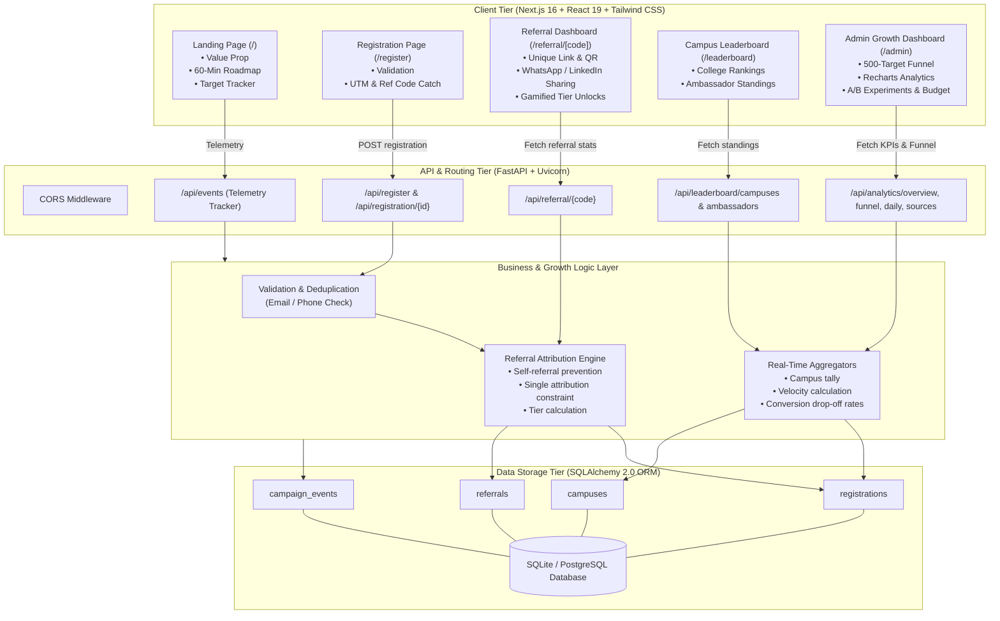
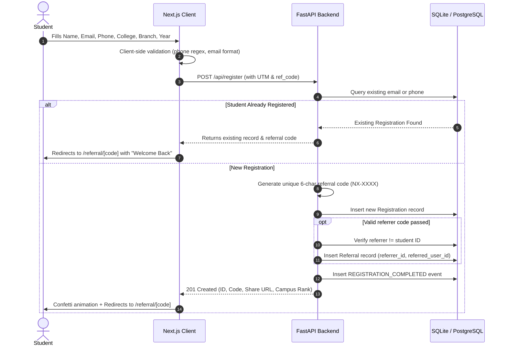

# Campus AI Sprint Growth Engine — Architecture Documentation

## 1. System Overview

The **Campus AI Sprint Growth Engine** is a full-stack, data-driven viral registration platform engineered to achieve 500 engineering student registrations within a 7-day campaign window under a ₹2,000 budget constraint.

Unlike a static landing page, this system couples workshop discovery with a multi-sided viral loop:
1. **Student Registration**: Captures student credentials, branch, graduation year, UTM tags, and referrer attribution.
2. **Referral Engine**: Auto-generates unique student referral codes (`NX-XXXX`), unique tracking URLs, and provides instant sharing to WhatsApp and LinkedIn.
3. **Campus Competition Leaderboard**: Aggregates live student registrations and referral volume by engineering institution, stimulating inter-college competitive pride.
4. **Real-time Growth Analytics Engine**: Tracks full-funnel drop-offs, daily acquisition velocity, acquisition channels, and evaluates proposed A/B growth experiments.

---

## 2. High-Level Architecture Diagram



---

## 3. Data Model & Database Schema

The database is built on SQLAlchemy 2.0 declarative models with clean separation of concerns and database-level constraints.

### 3.1. `registrations` Table
Stores participant records and attribution metadata.
- `id` (Integer, Primary Key)
- `name` (String, student full name)
- `email` (String, Unique, Indexed)
- `phone` (String, Indexed, 10-digit normalized)
- `college` (String, Indexed)
- `branch` (String)
- `graduation_year` (Integer)
- `source` (String, e.g., `whatsapp_groups`, `peer_referral`, `college_clubs`, `linkedin_posts`, `direct`)
- `utm_source` (String, nullable)
- `utm_medium` (String, nullable)
- `utm_campaign` (String, nullable)
- `referral_code` (String(32), Unique, Indexed, e.g., `NX-1024`)
- `referred_by` (String(32), Indexed, referral code of inviter)
- `created_at` (DateTime, UTC index)

### 3.2. `referrals` Table
Enforces single referral attribution and prevents duplicate counting or self-referrals.
- `id` (Integer, Primary Key)
- `referrer_id` (Integer, Foreign Key to `registrations.id`, Indexed)
- `referred_user_id` (Integer, Foreign Key to `registrations.id`, Unique, Indexed)
- `created_at` (DateTime, UTC)
- **Constraints**:
  - `CheckConstraint("referrer_id != referred_user_id")`
  - `UniqueConstraint("referred_user_id")`

### 3.3. `campuses` Table
Holds college institution metadata for ranking.
- `id` (Integer, Primary Key)
- `name` (String, Unique, Indexed)
- `city` (String)
- `state` (String)
- `tier` (String, Tier 1 / Tier 2)

### 3.4. `campaign_events` Table
Stores growth funnel telemetry events.
- `id` (Integer, Primary Key)
- `user_id` (Integer, Foreign Key to `registrations.id`, Nullable, Indexed)
- `event_type` (String, Indexed):
  - `LANDING_PAGE_VIEW`
  - `REGISTRATION_STARTED`
  - `REGISTRATION_COMPLETED`
  - `REFERRAL_PAGE_VIEW`
  - `REFERRAL_LINK_COPIED`
  - `WHATSAPP_SHARE_CLICKED`
  - `LINKEDIN_SHARE_CLICKED`
- `metadata_json` (Text / JSON payload)
- `created_at` (DateTime, UTC)

---

## 4. Core Growth Flows

### 4.1. Registration & Deduplication Flow


### 4.2. Viral Referral & Tier Unlocking Flow
Each registered student is automatically enrolled as an ambassador with 4 progressive unlock tiers:
- **Tier 1 (1 referral)**: AI Project Architecture Cheatsheet PDF
- **Tier 2 (3 referrals)**: Silver Builder — 20+ Technical Interview AI Prompt Templates
- **Tier 3 (5 referrals)**: Gold Ambassador — 1-on-1 Portfolio Code Review & Placement Spotlight
- **Tier 4 (10 referrals)**: Campus AI Champion — Official Certificate & Featured Leaderboard Placement

The pre-filled WhatsApp share URL formats a high-converting peer message:
```text
Hey! I'm joining NxtWave's free 'Build Your First AI Project in 60 Minutes' workshop. You can register here: https://[domain]/register?ref=NX-XXXX
```

### 4.3. Leaderboard Calculation
The campus standings query aggregates registrations grouped by college name:
$$\text{Campus Total} = \sum \text{Registrations}_{\text{college}}$$
$$\text{Referral Contribution \%} = \left(\frac{\text{Attributed Referrals}}{\text{Total Registrations}}\right) \times 100$$
Names of individual ambassadors are masked dynamically using `mask_name()` (e.g., "Arjun Sharma" becomes "Arjun S.") to preserve student privacy while maintaining authenticity.

---

## 5. Security & Robustness

- **Prototype Admin Authentication**: Admin routes and metrics require secret key verification against `ADMIN_SECRET_KEY` with sessionStorage persistence.
- **Cross-Origin Resource Sharing (CORS)**: Controlled through `ALLOWED_ORIGINS` environment variables.
- **Database Portability**: Built on standard SQLAlchemy abstraction. Runs out-of-the-box on zero-config SQLite locally, and swaps to PostgreSQL in production simply by updating `DATABASE_URL`.
- **Zero Hallucinated Numbers**: All analytics displayed in the Admin Dashboard, progress bar, and leaderboards are computed dynamically from actual SQL database queries.
