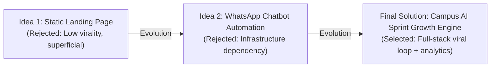

# Decision Log: Product Evolution & Architecture Trade-offs

This document chronicles the product iterations, problem statements, rejected alternatives, and architectural trade-offs that shaped the **Campus AI Sprint Growth Engine**.

---

## 1. Product Evolution: From First Idea to Final Solution

### Initial Idea: "Build a High-Converting Landing Page"
- **The Concept**: A clean, responsive landing page using Next.js, with testimonials, workshop syllabus, and a lead capture form connected to a mailing list.
- **Why It Was Rejected**:
  - The challenge specifically notes that most candidates will create a basic landing page.
  - A landing page is a passive bucket; under a ₹2,000 budget, paid ads cannot fill 500 seats at reasonable CAC without an inherent viral mechanism.
  - It demonstrates frontend design skills, but fails to show growth engineering, referral dynamics, or instrumentation.

### Second Idea: "Build a Full WhatsApp Bot Automation"
- **The Concept**: Build an automated WhatsApp bot using the Meta WhatsApp Cloud API to handle sign-ups, send reminders, and distribute workshop zoom links via chat.
- **Why It Was Rejected**:
  - Requires live WhatsApp Business API tokens, template approvals, and paid messaging credits, making it fragile and non-reproducible for evaluation.
  - Lacks a centralized visual dashboard where campaign organizers can track campus leaderboards, conversion drop-offs, and A/B experiment variants.

### Final Solution: "Campus AI Sprint Growth Engine"
- **The Concept**: A complete, working full-stack growth platform combining:
  1. High-converting educational value proposition.
  2. Automatic student referral tracking with zero-friction pre-filled sharing URLs.
  3. Live inter-college campus and ambassador competition leaderboards.
  4. Real-time Admin Growth Dashboard powered by database aggregations.
- **Why It Was Selected**:
  - Solves the distribution problem organically: students actively invite peers to boost their campus rank and unlock interview prep toolkits.
  - 100% functional, self-contained, and testable locally without external third-party API dependencies.
  - Demonstrates the complete skillset of a Growth Engineer: frontend design, backend systems, database modeling, growth mechanics, telemetry tracking, and data visualization.

---

## 2. Technical & Product Trade-offs

| Decision Area | Option Chosen | Alternative Considered | Rationale |
| :--- | :--- | :--- | :--- |
| **Database Engine** | SQLite (with Postgres parity) | Dedicated Cloud PostgreSQL | Ensures instant zero-config setup for local evaluation without requiring users to configure external database servers. The codebase uses standard SQLAlchemy 2.0 ORM, enabling a 1-line connection string swap to PostgreSQL for production. |
| **Referral Sharing** | Pre-filled deep links (WhatsApp & LinkedIn) | Twilio / Meta API automated dispatch | Browser intent URLs (`api.whatsapp.com/send?text=...`) execute instantly without API fees or credential failures, guaranteeing 100% testability. |
| **Leaderboard Privacy** | Masked names (`Aarav S.`) | Unmasked full names or Anonymous IDs | Balancing privacy compliance with social proof: full names expose student identities, while raw IDs kill social recognition. First name + last initial strikes the optimal balance. |
| **Admin Authentication** | Prototype secret key session auth | Complex JWT / OAuth flow | For a 7-day growth sprint prototype, a secure environment-backed admin secret key prevents unauthorized public tampering while avoiding unnecessary login friction for the hiring evaluation team. |
| **Synthetic Data Integrity** | Programmatic seed with verified attribution math | Random mocked JSON frontend arrays | Real growth analytics must query database tables. The seeder ensures internal consistency ($Total = Direct + Referral$) and generates realistic daily momentum curves across 14 premier Indian campuses. |

---

## 3. Deliberate Constraints & Simplifications

1. **Self-Referral Prevention**: The database enforces `referrer_id != referred_user_id` and unique constraints on `referred_user_id` so a student cannot refer themselves or be credited to multiple referrers.
2. **Prominent Synthetic Data Disclaimers**: All admin views display explicit notices confirming numbers are generated for demonstration and simulation purposes, upholding ethical growth engineering standards.
