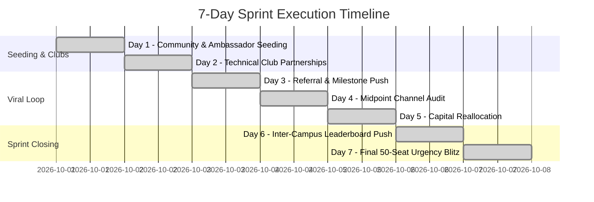

# Growth Plan: Campus AI Sprint (7-Day Acquisition Strategy)

## 1. Target Student Persona

- **Primary Persona**: Final-year engineering undergraduates (B.Tech / B.E, 2025/2026 batches).
- **Academic Disciplines**: Computer Science & Engineering (CSE), Information Technology (IT), Electronics & Communication (ECE), and core engineering disciplines transitioning to software roles.
- **Career Phase**: Actively preparing for campus placements, off-campus recruitment drives, and technical screening interviews.

---

## 2. Why Students Care (Value Propositions)

1. **Resume Differentiation**: Recruiters discard resumes listing only classroom academic projects (e.g., generic library management systems). A deployable AI project with structured API integrations stands out immediately.
2. **Practical AI Exposure**: Students are tired of theoretical machine learning math and want hands-on experience building with modern LLM APIs.
3. **Portfolio Deliverables**: Every attendee walks away with a working GitHub repository, a deployed application link, and 3 placement-vetted resume bullet points.
4. **Low Time Commitment**: 60 focused minutes eliminates the drop-off associated with multi-week bootcamps.
5. **Zero Financial Friction**: 100% free access removes administrative and payment hurdles.

---

## 3. Core Campaign Message

> **"Build a working AI project in 60 minutes — for free."**
>
> *Supporting Hook:* "Go from 'I want an AI project' to a working project you can explain in your next interview."

---

## 4. Priority Distribution Channels

Rather than diffusing energy across 20 unverified channels, the campaign focuses relentlessly on four high-leverage student touchpoints:

| Priority Channel | Strategic Role | Channel Rationale |
| :--- | :--- | :--- |
| **A. College WhatsApp Groups & Class Communities** | Primary Seeding Engine | Unofficial placement coordination, CR (Class Representative) groups, and hostel channels have >90% open rates among final-year students. |
| **B. Student Clubs & Technical Societies** | Institutional Endorsement | Partnerships with campus Coding Clubs, IEEE student branches, and GDG chapters provide instant credibility. |
| **C. Viral Referral & Campus Ambassador Loop** | Exponential Multiplication | Post-registration incentives (inter-college leaderboard + AI Interview Toolkit unlock) turn attendees into organic promoters. |
| **D. LinkedIn Student Networks** | Professional Social Proof | Peer registrations and badge sharing on LinkedIn trigger professional FOMO among placement-seeking students. |

---

## 5. Seven-Day Tactical Campaign Execution

- **Day 1: Seed Campus Communities & Early Ambassadors**
  - Seed 30 key campus influencers, departmental CRs, and placement student coordinators across 10 target engineering colleges.
  - Distribute clean, value-first copy highlighting the 60-minute deliverable with referral links.
- **Day 2: Student Club Distribution**
  - Engage 15 college coding societies and AI clubs with co-branded invitations.
  - Club leads receive custom club referral tracking links.
- **Day 3: Referral Push & Toolkit Unlocks**
  - Announce the *Campus AI Champion* toolkit reward: referring 3 classmates unlocks 20+ placement prompt engineering templates.
  - Observe viral coefficient inflection.
- **Day 4: Channel Audit & Performance Review**
  - Audit Admin Dashboard analytics. Evaluate registrations per source, campus volume, and cost per registration (CAC).
  - Identify lagging vs standout colleges.
- **Day 5: Double Down on Standout Sources**
  - Reallocate contingency budget (₹400) directly into the top-converting channel (e.g., WhatsApp placement community amplification).
- **Day 6: Campus Leaderboard Rivalry Push**
  - Highlight the top 3 colleges on the live leaderboard.
  - Launch targeted community messages: *"IIT Madras is only 14 registrations away from surpassing DTU for the #1 spot!"*
- **Day 7: Final Urgency & Seat Scarcity Blitz**
  - Trigger "Final 50 Seats Remaining" urgency notices across all active channels.
  - Lock registrations at 500 cap to preserve workshop mentorship quality.

---

## 6. Registration Target Planning Model (Target: 500)

*Note: The numbers below represent an operational planning hypothesis and expected contribution model, not guaranteed projections.*

| Acquisition Channel | Budget Allocated | Target Registrations | Key Planning Assumptions | Expected Contribution % |
| :--- | :--- | :--- | :--- | :--- |
| **College WhatsApp Groups** | ₹700 (amplification) | **175** | 35 active groups reached; avg 5 registrants per group with high placement intent. | 35.0% |
| **Viral Referral Loop** | ₹500 (incentives) | **150** | Viral K-factor of 0.42; 350 direct registrants generate 150 attributed peer sign-ups. | 30.0% |
| **Student Clubs & Tech Societies**| ₹0 (partnership) | **90** | 10 college clubs broadcasting to members; avg 9 conversions per club. | 18.0% |
| **LinkedIn Student Networks** | ₹400 (micro-creatives) | **55** | Organic peer reposts & micro-promotions yielding organic CTR. | 11.0% |
| **Direct & Community Contingency** | ₹400 (reallocation) | **30** | Mid-campaign capital boost into highest-performing channel on Day 5. | 6.0% |
| **Total Campaign Model** | **₹2,000** | **500** | **Blended Target CAC: ₹4.00 per registered engineering student.** | **100.0%** |

---

## 7. Budget Reallocation Framework

The ₹2,000 budget is treated as an experiment portfolio rather than fixed spend:
- **₹700**: Student community micro-amplification in verified placement channels.
- **₹500**: Campus ambassador recognition, certificates, and top driver rewards.
- **₹400**: Creative distribution experiments (headline A/B test variations).
- **₹400**: Contingency reserve held until Day 4 audit.

**Reallocation Rule:** If WhatsApp referral velocity exceeds LinkedIn acquisition by >2.5x by Day 4, the entire ₹400 contingency is shifted to fuel WhatsApp community distribution.
